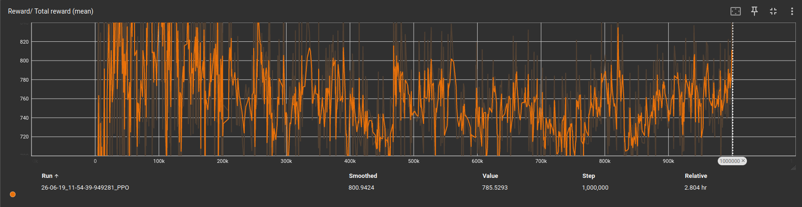
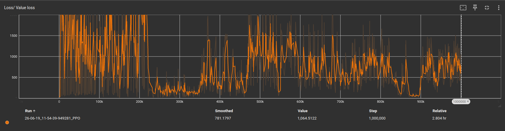
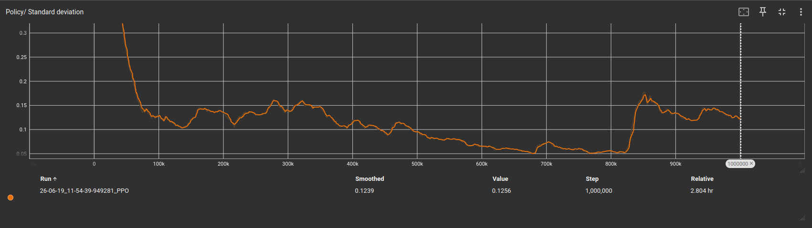

# Kinova Gen3 RL Sphere Pushing — NVIDIA Isaac Lab

PPO reinforcement learning environment training a Kinova Gen3 7-DOF arm to push a sphere to a target location using NVIDIA Isaac Lab with 512 parallel environments over 1,000,000 timesteps.

## Technical Details

- **Robot:** Kinova Gen3 7-DOF arm
- **Algorithm:** PPO (skrl 1.4.3)
- **Parallel environments:** 512
- **Timesteps:** 1,000,000
- **Action space:** End-effector position deltas via Differential IK
- **Observation space:** Joint positions + EE position + sphere position + target position

## Training Results


Total reward stayed flat around 780 throughout training, the agent found a strategy early but never improved it.


Value loss oscillated between 0 and 1500 without converging. The agent struggled to consistently predict future rewards, indicating the task remained too unpredictable.


Policy entropy decreased from 0.3 to 0.05 showing the agent became more decisive, but spiked back up at 800k, that is a sign that the agent had to restart exploration after getting stuck.
## Next Steps

More complex reward system to prevent the arm from finding shortcuts. Migration to Isaac Sim 6.0 once Isaac Lab 3.0 leaves beta — the rendering issue on RTX 50-series GPUs is reportedly solved in that version.

## How to Run

```bash
conda activate isaacenv
python train.py --headless
```

## Requirements

- NVIDIA Isaac Lab 2.1.0
- Isaac Sim 4.5.0
- Python 3.10
- skrl 1.4.3
- CUDA-compatible GPU (tested on RTX 5070)

## Author

Youcef Sellai — Mechanical Engineering Student
Gina Cody School of Engineering, Concordia University